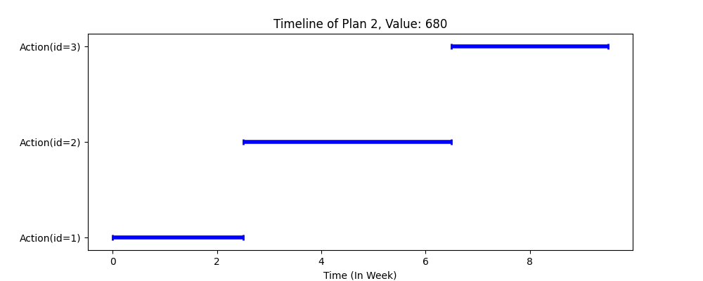
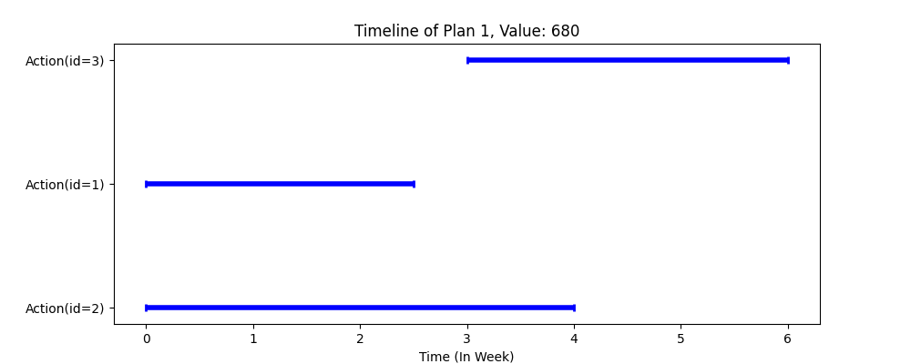

# Planner

This is implementation of an AI planner using Python. The program allows users to pass planning problems as Json files and get the solution as a Json file, along with visual representations of solutions. The program translates the planning problem into a graoh structure and uses a search algorithm to find the solution. To perform the graph search both forward and backward search are implemented, but the backward is being used as defualt as it shows better performance. Currently, both search algorithms are implemented using BFS, but the program is designed to be easily extended to other search algorithms. There are three main advantages with this planner. First, different than most of planners, it is designed to find all feasible solutions, not just one. Second, based on the aforementioned feature, it is possible to enumerate all feasible solutions and compare them based on different criteria. Third, the program extends the concept of planning to scheduling, which means it also provides detailed schedules for the solutions.

## Table of Contents

- [Installation](#installation)
- [Usage](#usage)
- [Contributing](#contributing)
- [License](#license)

## Installation

Instructions on how to install the project and how to get started.

- git clone https://conf.informatik.uni-hamburg.de/dtec/planner.git
- Run pip install -r requirements.txt
- Locate your Json input file in the inputs directory, and provide the file name as the input argument along with an arbitrary name for the corresponding output folder. If you wish to see the solution and the visual representation of the solution, use the --print and --visualize arguments, respectively. Run the program using the following command:
    - ```python src/main.py --input <input_file> --output <output_file> --print --visualize```

- To see the help menu, run the following command:

    - ```python src/main.py --help```

## Usage

Instructions on how to use the project and how to get started.

- Example 1:
    - ```python src/main.py --input sample1.json --output sample1 --print --visualize```
    - This will make a folder named sample1 in the outputs directory saves the following files:
        - sample1.json: The detailed solution in Json format
        - plans/*.png: The visual representations of the plans found. Below you can see an example of the visual representation of the plan found for the sample1.json file:
        
        - schedules/*.png: The visual representations of the schedules for the plans found. Below you can see an example of the visual representation of the schedule found for the sample1.json file:
        


## Contributing

Guidelines for contributing to the project and how to submit pull requests.

## License

Information about the project's license and any additional terms or conditions.
